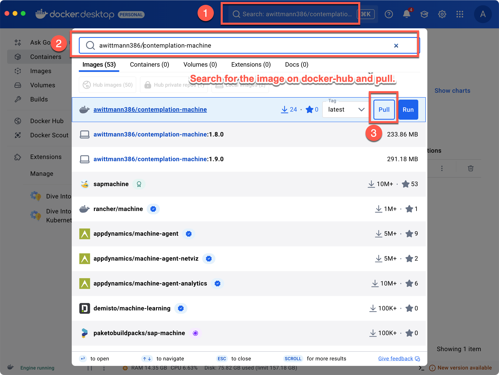
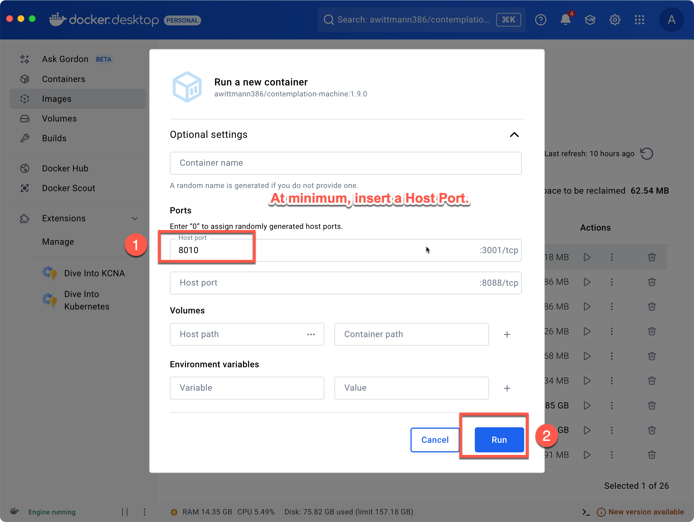
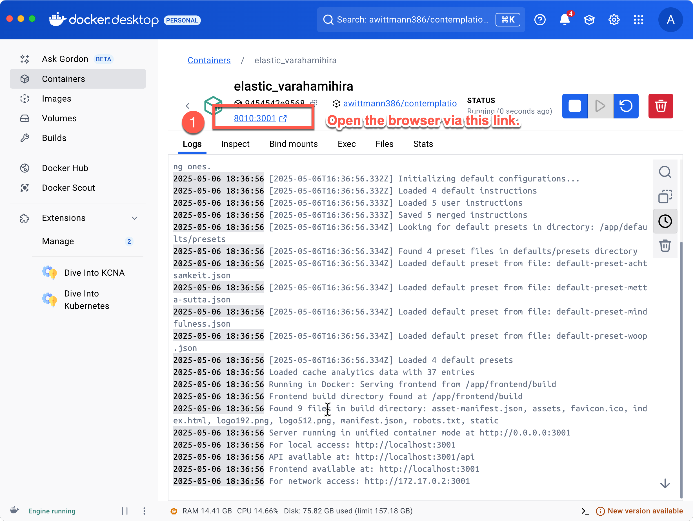
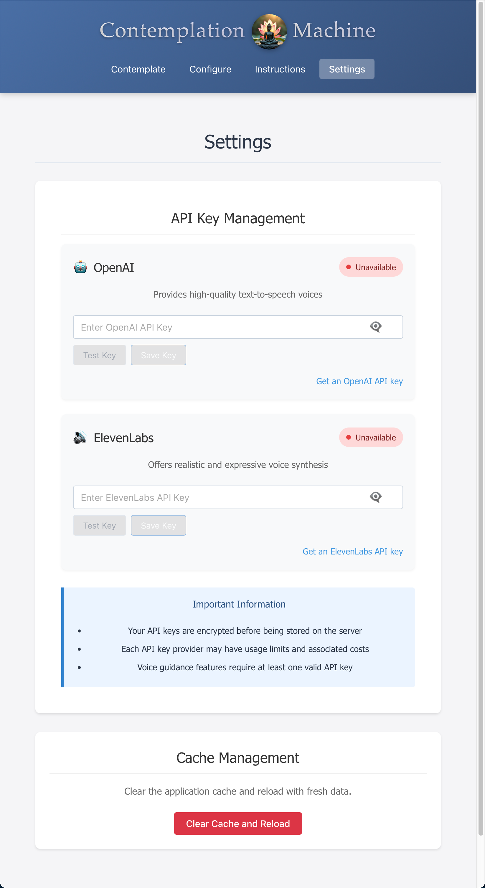
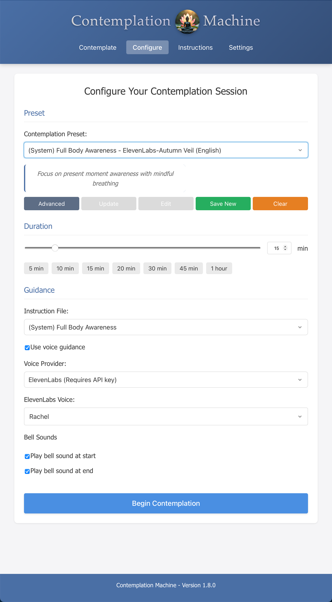
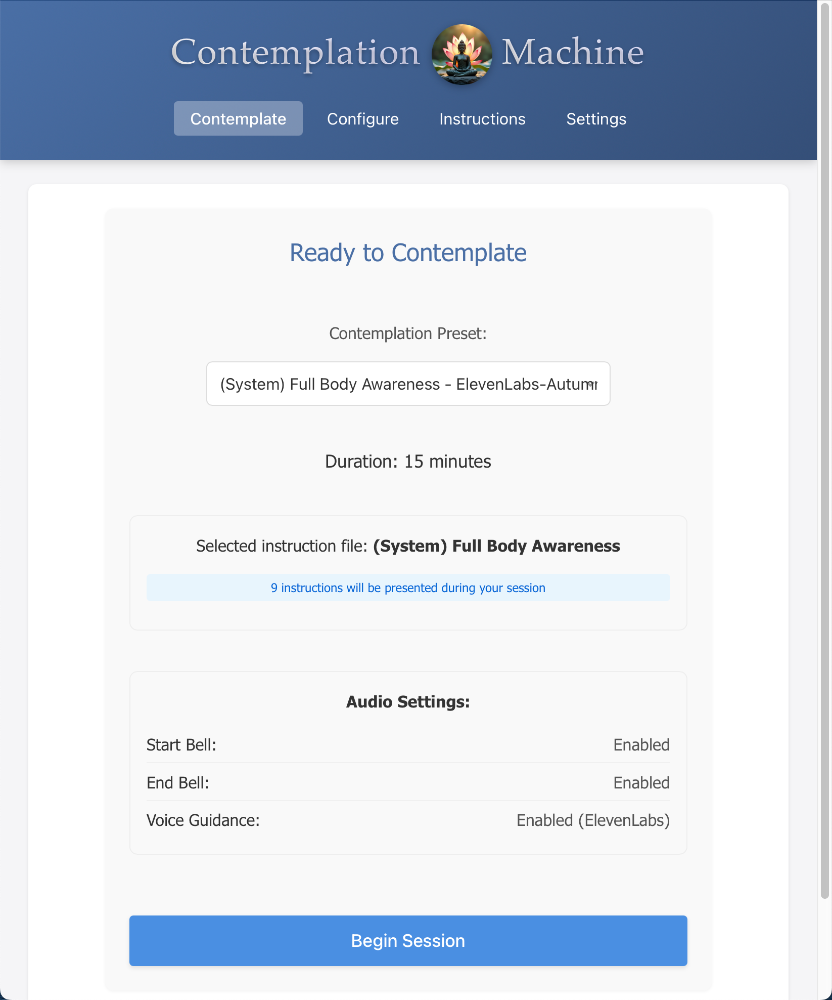
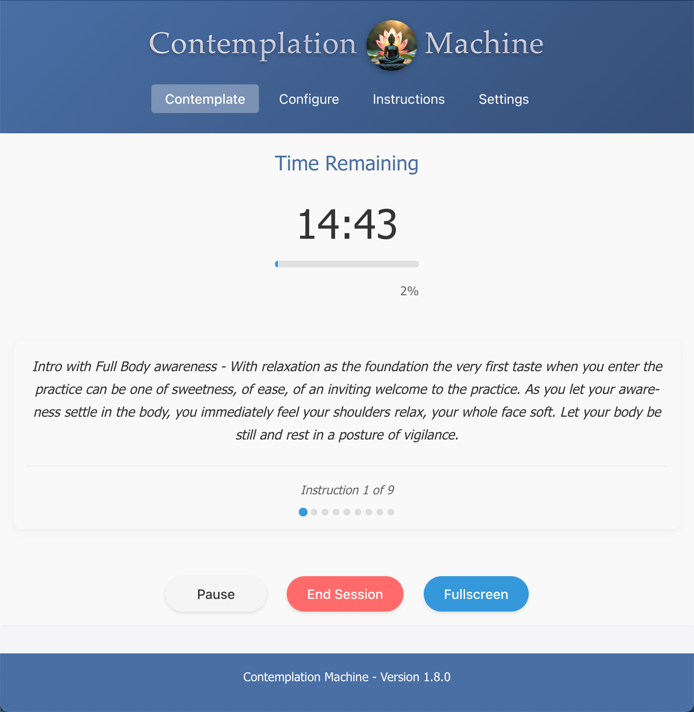
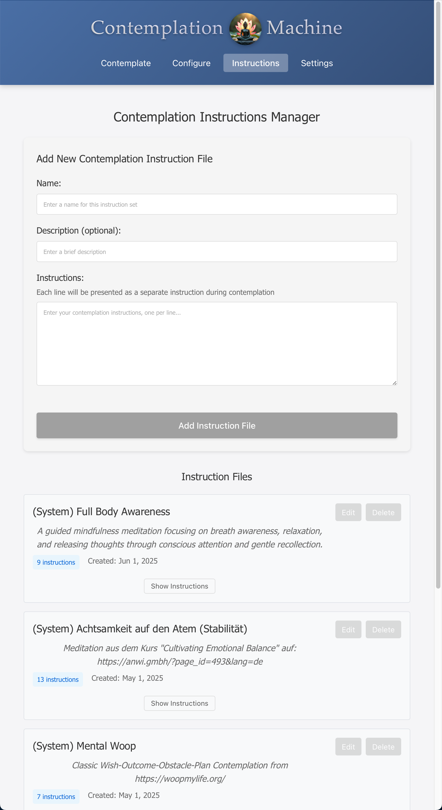
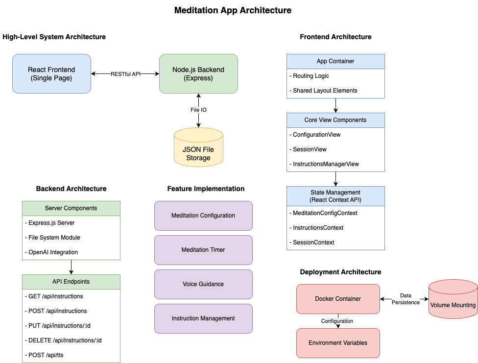
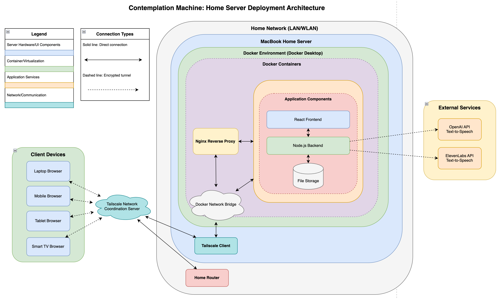

# ✨ Contemplation Machine ✨


## 🧘 Introduction

### The Art of Contemplation
<div style="float: left; margin-right: 20px; margin-bottom: 10px; text-align: center; max-width: 300px;">
  
  <p><em>Created with Flux.1-dev in DiffusionBee on a MacBook Pro M2</em></p>
</div>

The Contemplation Machine is a **simple meditation app** with a *powerful purpose*: to facilitate **deep contemplation** through structured exposure to meaningful ideas.

At its core, the app takes any set of instructions or contemplative statements and *evenly distributes* them across your chosen meditation timeframe, delivering them through **high-quality text-to-speech**. This simple approach serves a profound function.

> Contemplation works like a magnifying glass focusing sunlight on paper - when held steady long enough, ignition occurs.

Similarly, when the mind rests on a single thought, verse, or question for an extended period, a *natural deepening occurs*. Without effort, understanding penetrates beyond the surface, revealing layers of meaning inaccessible through casual reading.

This differs from active analytical thinking, which moves constantly from point to point. In contemplation, we **hold the mind steady** on one subject, allowing insight to emerge organically. Both active thinking and contemplative focus serve as stages of meditative deepening (*Jhanas*), but each operates differently.

**Repetition** is another crucial factor that leads to *sustainable transformation* of the mind. The Contemplation Machine facilitates this through consistent, rhythmic exposure to key concepts over time. Just as water gradually shapes stone, repeated encounters with meaningful ideas reshape our mental patterns and neural pathways. This repetition isn't mere rote learning—it's a **deliberate practice** that embeds wisdom into our being, making transformation not just momentary but **lasting and profound**.

The Contemplation Machine offers a structured container for this practice, whether you're working with personal goals, wisdom teachings, philosophical questions, or any content worthy of deeper reflection. It creates the conditions for your natural wisdom to emerge through the simple power of **sustained attention** and **consistent repetition**.

---

### The Contemplation Machine
<div style="float: left; margin-right: 20px; margin-bottom: 10px; text-align: center; max-width: 300px;">
  
  <p><em>Created with Dalle-E in ChaptGPT</em></p>
</div>

Contemplation Machine is an **open-source mindfulness application** designed to help users establish and maintain a meditation practice with minimal complexity. With a focus on *accessibility* and *customization*, the application delivers guided meditation sessions with different voice options and configurable content while maintaining a clean, distraction-free interface.

While it comes with pre-loaded meditations and contemplations, these are merely **examples** that demonstrate its capabilities. The *true power* of the application lies in its ability to **transform any text into a personalized contemplation session** with minimal effort. The Contemplation Machine is designed to create personal contemplation sessions with ease, taking any meaningful text—whether it's poetry, philosophy, academic content, personal affirmations, or spiritual teachings—and converting it into structured stanzas for meditation.

These stanzas are then delivered as both **visual text cues** and **high-quality audio guidance** at precisely timed intervals throughout your practice, allowing for *unlimited personalization*:

- **Transform Complex Ideas**: Break down challenging concepts into digestible contemplative phrases
- **AI-Assisted Content Creation**: Use AI chat tools like ChatGPT to summarize important texts into meaningful stanzas
- **Personal Development**: Create custom affirmations that sink deeply into your consciousness through structured repetition
- **Learning Enhancement**: Convert study materials into contemplative sessions for deeper understanding
- **Spiritual Practice**: Experience spiritual texts in a format designed for profound internalization

This personalization capability, combined with repetition over time, leads to *sustainable transformation of the mind*—not just momentary insight but **lasting and profound change**. The included meditations are just a starting point; the application truly shines when you bring your own meaningful content to it.

Originally developed as a private project, Contemplation Machine is now open source.

---

## ⭐ Features

### Core Features
- ✓ **Customizable meditation timer** with precise duration control
- ✓ **Voice guidance** with multiple provider options
- ✓ **Session configuration presets** (both default and user-created)
- ✓ **Comprehensive meditation instruction management**
- ✓ **Audio cues** for session start/end
- ✓ **Fullscreen distraction-free** meditation mode
- ✓ **Multilingual support** (currently English and German)

### Voice Guidance Options
- 🔊 **Browser native Text-to-Speech** (no API key required)
- 🔊 **OpenAI Text-to-Speech API**
- 🔊 **ElevenLabs Text-to-Speech API**

### Preset Management
- 💾 **Save and load** meditation configurations
- 📝 **Custom names and descriptions**
- 🔄 **Quick switching** between presets
- 🔧 **Update and delete** capabilities
- 🔗 **Unified interface** across pages

---

## 🛠️ Installation

### Prerequisites
- **Node.js** 18 or higher
- **Docker** (for containerized deployment)
- **OpenAI API key** (optional)
- **ElevenLabs API key** (optional)

### Local Development Setup

1. **Clone the repository**:
   ```bash
   git clone https://github.com/yourusername/contemplation-machine.git
   cd contemplation-machine
   ```

2. **Install dependencies**:
   ```bash
   # Install backend dependencies
   cd backend
   npm install
   
   # Install frontend dependencies
   cd ../frontend
   npm install
   ```

3. **Set up environment variables**:
   ```bash
   # At project root
   cp sample.env .env
   ```
   Edit the `.env` file with your preferred configuration and API keys (if applicable).

4. **Start the development servers**:
   ```bash
   # Start backend server
   cd backend
   npm start
   
   # In a separate terminal, start frontend server
   cd frontend
   npm start
   ```

### Docker Deployment

#### Option 1: Command Line Deployment

1. **Clone the repository** and navigate to the project directory.

2. **Configure your environment**:
   ```bash
   cp sample.env .env
   ```
   Edit the `.env` file with your preferred configuration.

3. **Build and start the containers**:
   ```bash
   docker-compose up -d
   ```

4. **Access the application** at `http://localhost:8088`

#### Option 2: Docker Desktop Deployment from Docker Hub

If you prefer using Docker Desktop's graphical interface to deploy the Contemplation Machine, follow these steps:

1. **Search for the image on Docker Hub**:
   
   Open Docker Desktop and click on the search bar at the top of the window.
   
   
   
   Type `awittmann386/contemplation-machine` and select it from the search results.

2. **Pull the image**:
   
   Click the "Pull" button to download the image to your local machine.
   
   

3. **Run a new container**:
   
   After pulling the image, click the "Run" button next to the image in Docker Hub or Images list.
   
   In the "Run a new container" dialog:
   - You can optionally set a container name
   - **Important:** Add a host port mapping (8010:3001 as shown in the image)
   
   
   
   Click "Run" to start the container.

4. **Access the application**:
   
   Once running, you can access the application by:
   - Clicking on the container name in Docker Desktop
   - Clicking the link shown under "PORT(S)" (typically http://localhost:8010)
   - Or opening your browser and navigating to http://localhost:8010

The application logs displayed in Docker Desktop will show when the server is fully initialized and ready to use.

### Setting up API Keys

#### OpenAI API Key

1. Go to [https://platform.openai.com](https://platform.openai.com)
2. Sign in or create an account
3. Navigate to API keys section in your account dashboard
4. Click "Create new secret key"
5. Give your key a name (e.g., "Contemplation Machine")
6. Copy the key immediately (OpenAI will only show it once)

#### ElevenLabs API Key

1. Go to [https://elevenlabs.io](https://elevenlabs.io)
2. Sign in or create an account
3. Navigate to your Profile Settings
4. Find the "API" section
5. Copy your API key (or generate a new one if needed)

### Security Note

- Never commit your `.env` file with real API keys to version control
- Keep your API keys secret and don't share them publicly
- The `.env` file should already be listed in your `.gitignore` file

---

## 📖 User Guide

### Getting Started

1. **Launch the application** - Access via your browser at localhost:8088 (or your configured domain)
2. **Configure your session** - Adjust the duration, voice settings, and choose guided instructions
3. **Create or select a preset** - Choose from default presets or create your own
4. **Begin meditation** - Start your session and follow the guided instructions
5. **End session** - When complete, you can end manually or wait for the timer to finish

### Application Screenshots

<div style="display: flex; flex-wrap: wrap; gap: 20px; justify-content: center;">
  <div style="flex: 1; min-width: 300px; max-width: 450px; margin-bottom: 20px;">
    
    <p><em>Settings page showing API key management for OpenAI and ElevenLabs text-to-speech services. API keys are encrypted before being stored on the server, ensuring secure voice synthesis integration.</em></p>
  </div>
  <div style="flex: 1; min-width: 300px; max-width: 450px; margin-bottom: 20px;">
    
    <p><em>Configuration page where users can customize meditation sessions. The interface provides options for session duration, instruction selection, voice guidance settings, and the ability to save custom presets for future use.</em></p>
  </div>
</div>

<div style="display: flex; flex-wrap: wrap; gap: 20px; justify-content: center;">
  <div style="max-width: 450px;">
    
    <p><em>The Ready to Contemplate page displays a summary of the configured session settings before beginning. Users can review their selected instruction set, session duration, and audio preferences before starting their meditation practice.</em></p>
  </div>
  <div style="flex: 1; min-width: 300px; max-width: 450px; margin-bottom: 20px;">
    
    <p><em>Active meditation session showing a contemplation instruction with progress timer. The clean, distraction-free interface displays the remaining time, current instruction, and progress through the meditation sequence.</em></p>
  </div>
</div>

<div style="display: flex; justify-content: center; margin-bottom: 20px;">
   <div style="flex: 1; min-width: 300px; max-width: 450px; margin-bottom: 20px;">
    
    <p><em>Instructions Manager page where users can view, create, edit, and delete contemplation instruction files. Each instruction set can contain multiple lines that will be presented individually during meditation sessions.</em></p>
  </div>
</div>

### Voice Configuration

**🎤 Browser Native TTS**
- *No configuration required*
- Uses your browser's built-in text-to-speech capabilities
- Quality and voice options will vary by browser/device

**🎤 OpenAI TTS**
- *Requires OpenAI API key*
- Configure through the settings page
- Offers high-quality natural voices

**🎤 ElevenLabs TTS**
- *Requires ElevenLabs API key*
- Configure through the settings page
- Provides natural-sounding, customizable voices

### Creating Custom Contemplations

1. Navigate to the **Instructions page**
2. Click "**Add New Instruction**"
3. Provide a **name**, **description**, and the **instruction content**
4. Format your content with section headers using the "**Section Name - **" format
5. **Save** your custom instruction
6. **Use it** in any meditation session by selecting it from the dropdown

> For best results, structure your content into clear, concise stanzas that contain complete thoughts. The application will distribute these stanzas evenly throughout your meditation session, creating natural pauses for contemplation between each one.

### Working with Presets

Presets allow you to save and reuse specific contemplation configurations, including:

- Session duration
- Background sound selection
- Voice guidance settings
- Instruction selection and timing
- Ending behavior

The app provides two types of presets:

- **Built-in Presets**: Pre-configured presets that come with the application
- **Custom Presets**: Presets you create and save yourself

#### Creating Presets

1. Configure contemplation settings in the app
2. Click "Save as Preset"
3. Enter a name and optional description
4. Click "Save"

#### Managing Presets

- **Rename**: Edit the name or description of existing presets
- **Update**: Save new settings to an existing preset
- **Delete**: Remove presets you no longer need
- **Apply**: Quickly load a preset's settings for your session

#### File System Organization

Presets are stored in a specific directory structure:

```
contemplation-machine/
├── defaults/
│   └── presets/           # Built-in presets (individual JSON files)
└── data/
    └── presets/           # Custom presets (individual JSON files)
```

#### Preset File Format

Each preset is stored as a JSON file with the following format:

```json
{
  "id": "preset-1234567890123",
  "name": "Example Preset",
  "description": "An example contemplation preset",
  "isDefault": true,
  "createdAt": "2025-04-30T12:00:00.000Z",
  "updatedAt": "2025-04-30T12:00:00.000Z",
  "config": {
    "duration": 10,
    "useVoiceGuidance": true,
    "voiceType": "openai",
    "openaiVoice": "alloy",
    "backgroundSound": "nature",
    "backgroundVolume": 0.5,
    "instructions": [
      {
        "id": "default-instruction-1",
        "playAt": 0
      }
    ],
    "endBehavior": "bell"
  }
}
```

#### Development Feature: "Promote to Default" Button

The "Promote to Default" button found in the Advanced Dialog for Presets in the Configuration Page is specifically designed as a **development tool**. It allows developers working on the Contemplation Machine to:

1. Design and test new presets during development
2. Promote well-designed presets to become part of the built-in presets in future releases
3. Easily transfer preset configurations from the development environment to the release package

When a preset is promoted using this button:
- It's copied to the `defaults/presets/` directory
- The `isDefault` property is set to `true`
- It becomes a candidate for inclusion in the next release

**Note:** This feature is intended for development purposes only. Regular users typically won't need this functionality as it relates to preparing content for future releases of the application.

#### Advanced Preset Management

**Manual Preset Creation:**
1. Create a JSON file following the preset format above
2. Save it in the `data/presets/` directory
3. Ensure it has a unique ID (format: `preset-` followed by timestamp)
4. Restart the application

**Backing Up Presets:**
- Copy the `data/presets/` directory to preserve your custom presets

**Migrating Presets Between Installations:**
1. Copy preset JSON files from source installation
2. Place them in target's `data/presets/` directory
3. Restart the application

#### Preset Management Best Practices

- Use unique, descriptive names for presets
- Add detailed descriptions to explain the purpose of each preset
- Review and clean up unused presets periodically
- Back up preset files before major updates

---

## 💻 Development

### Technical Architecture

#### 🖥️ Frontend (React)
- Single page application
- Context-based state management
- Responsive design
- Component-based architecture

#### 🔧 Backend (Node.js)
- Express.js server
- File-based storage
- REST API endpoints
- Audio file caching

#### 🗄️ Data Storage
- JSON files for instructions
- JSON files for presets
- Cached audio files
- Local storage for preferences

### File System Organization

```
contemplation-machine/
├── defaults/
│   └── presets/           # Built-in presets (individual JSON files)
└── data/
    └── presets/           # Your saved presets (individual JSON files)
    └── audio-cache/       # Cached audio files for TTS
```

### Updating the Application

To update to a new version:

1. Pull the latest code:
   ```bash
   git pull
   ```

2. Rebuild and restart the container:
   ```bash
   docker-compose down
   docker-compose build
   docker-compose up -d
   ```

### Troubleshooting

#### Common Issues

1. **"Error: Load failed" Issue**
   - Check browser console for specific errors
   - Verify Docker logs: `docker-compose logs -f`
   - Try a hard refresh (Ctrl+Shift+R or Cmd+Shift+R)
   - Clear browser cache and reload

2. **API Keys Not Working**
   - Verify the environment variables are correctly set in `.env` file
   - Check if keys are valid and have necessary permissions

3. **Audio Generation Fails**
   - Check OpenAI API key status and quota
   - Verify the TTS endpoints are accessible from your environment

4. **Container Fails to Start**
   - Check Docker logs for startup errors
   - Verify port 8088 is not used by another application

---

## 📊 Architecture Diagram

### Application Architecture


This diagram illustrates the core application architecture of the Contemplation Machine, showing how the frontend and backend components interact. The React-based frontend communicates with the Node.js backend via RESTful APIs, while the backend manages meditation instructions, presets, and handles text-to-speech processing through various service providers.

### Deployment Architecture

The Contemplation Machine is designed for flexible deployment options, with a focus on secure home server deployment. The diagram below illustrates the recommended setup for running the application on a home server with secure remote access capabilities.



#### Deployment Components

**Home Network Environment:**
- **MacBook Home Server** - The primary hardware hosting the Contemplation Machine
- **Docker Environment** - Runs containerized versions of all application components
- **Docker Containers:**
  - **Contemplation Machine Container** - Houses both frontend and backend components
  - **Nginx Reverse Proxy** - Handles routing and secure access to the application

**Application Components:**
- **React Frontend** - The user interface for the meditation application
- **Node.js Backend** - Processes requests and manages application logic
- **File Storage** - Stores meditation presets, instructions, and cached audio files

**Network Components:**
- **Tailscale Client** - Provides secure remote access through encrypted tunnels
- **Home Router** - Connects the server to both local network and internet
- **Docker Network Bridge** - Facilitates communication between containers

**External Services:**
- **OpenAI API** - Provides high-quality text-to-speech capabilities
- **ElevenLabs API** - Offers alternative text-to-speech with customizable voices
- **Tailscale Network** - Coordinates secure connections between devices

#### Secure Remote Access

The deployment architecture enables secure access to the Contemplation Machine from anywhere, without exposing ports to the internet:

1. Tailscale creates an encrypted mesh network between authorized devices
2. Client devices (laptops, phones, tablets) connect to the application through this secure network
3. All traffic is end-to-end encrypted between devices and the home server
4. No port forwarding required, reducing security risks

This deployment model provides the perfect balance of accessibility, security, and privacy for your meditation practice.

---

## 📜 License

Contemplation Machine is licensed under the [MIT License](./LICENSE).

---

## ❓ Frequently Asked Questions

### General Questions

**Q: What makes Contemplation Machine different from other meditation apps?**  
A: Contemplation Machine focuses on deep contemplation through structured exposure to meaningful ideas. Unlike apps that only offer guided meditations or simple timers, Contemplation Machine allows you to transform any meaningful text into a personalized contemplative experience with both visual and audio guidance.

**Q: Do I need to be an experienced meditator to use this?**  
A: Not at all! Contemplation Machine is designed for both beginners and experienced practitioners. The guided nature of the sessions provides structure for newcomers, while the customization options satisfy advanced users.

**Q: Is this application affiliated with any particular spiritual tradition?**  
A: No. While some presets include content from various wisdom traditions, Contemplation Machine is a secular tool that can be used with content from any tradition or none at all.

### Technical Questions

**Q: Are my meditation presets stored in the cloud?**  
A: No. All presets and configurations are stored locally on your device or server. There is no cloud storage component or user accounts.

**Q: Do I need an internet connection to use Contemplation Machine?**  
A: An internet connection is required only if you want to use the OpenAI or ElevenLabs voice synthesis features. The browser-native text-to-speech works offline after initial setup.

**Q: Can I use this application on mobile devices?**  
A: Yes, Contemplation Machine has a responsive design that works on mobile browsers. However, for the best experience, we recommend using a tablet or desktop.

**Q: Are there any known issues with text-to-speech on mobile devices?**  
A: Yes, browser-native TTS engines on mobile devices sometimes have compatibility issues, particularly on Apple iPhones and iPads where the feature can be unstable. For iOS devices, we recommend using iCabMobile browser (available on the App Store) which provides the best TTS service quality. Laptop and desktop computers generally don't experience these TTS compatibility problems.

### Content Questions

**Q: How do I format my own contemplation text?**  
A: The best format is to create distinct "stanzas" or thoughts separated by section names. Each section should follow this format: "Section Name - Your contemplation text here." This allows the application to properly distribute the content throughout your session.

**Q: Can I import meditation instructions from other sources?**  
A: Yes! You can copy content from books, articles, or other sources and format it according to our guidelines. The application also works well with AI-generated content from tools like ChatGPT when you need to summarize or restructure longer texts.

**Q: What language does Contemplation Machine support?**  
A: The interface currently supports English and German. For contemplation content, you can use any language supported by your chosen voice synthesis engine (browser native, OpenAI, or ElevenLabs).

# History: The AI-Assisted Development Journey

## A New Approach to Development

The Contemplation Machine represents a fascinating case study in modern software development—one where the traditional barriers between experienced and novice developers have been significantly lowered through the use of advanced AI assistance. Despite having 30 years of IT experience, the creator had limited experience with JavaScript and the specific frameworks used in this project. Yet, through the use of GitHub Copilot's Agent Mode and effective prompting techniques, he was able to develop a sophisticated full-stack application that would normally require months of dedicated work by an experienced JavaScript developer.

> "The entire development and documentation process was completed using GitHub Copilot Agent Mode and prompting techniques, despite having little experience with JavaScript and the concrete frameworks used in the application."

**Most remarkably, the entire core development was completed in just 3 days by a single person, with an additional day dedicated to preparing the project for public open source release.** This compressed timeline would have been impossible using traditional development approaches.

## The Power of AI-Assisted Development

This development approach highlights the transformative capabilities of GitHub Copilot's Agent Mode, which was released in February 2025. Unlike traditional code suggestion tools, Agent Mode functions as an autonomous peer programmer that can:

- Perform multi-step coding tasks across an entire codebase
- Recognize and fix errors automatically through self-healing capabilities
- Suggest and implement terminal commands
- Generate, refactor, and deploy code across multiple files
- Create entire applications from conceptual descriptions

These capabilities were leveraged extensively during the development of The Contemplation Machine, enabling the creation of a complex application that includes:

- A React-based single-page application frontend
- An Express.js backend with RESTful API endpoints
- Integration with external APIs (OpenAI and ElevenLabs)
- Docker containerization with nginx reverse proxy
- Comprehensive documentation

## Development Timeline and Process

### Concept Phase
The initial concept for The Contemplation Machine was defined, outlining the core features and architecture of a meditation application with AI-generated content and high-quality text-to-speech.

### Version 1.0 - 1.1.0 (Day 1)
Using GitHub Copilot Agent Mode, the initial MVP was developed. This included setting up the basic React frontend, Express.js backend, and establishing the core functionality. Agent Mode was particularly useful in scaffolding the project structure and implementing the foundational components.

### Versions 1.2.0 - 1.5.0 (Day 2)
Iterative feature development and refinement. During this phase, Copilot Agent Mode was tasked with implementing more complex features, such as the integration with OpenAI and ElevenLabs APIs. The AI assistant handled the nuances of these integrations, reducing what would typically be weeks of research and implementation to hours of guided development.

### Versions 1.6.0 - 1.7.0 (Day 3)
System optimization and deployment configuration. Copilot Agent Mode was instrumental in creating Docker containerization and setting up the nginx reverse proxy, areas that typically require specialized knowledge.

### Version 1.8.0 (Day 4 - Current)
Final refinements and comprehensive documentation. The documentation process itself was AI-assisted, with Copilot Agent Mode generating technical documentation based on the implemented code and system architecture. This final day was dedicated to preparing the project for public open source release.

## Implications for Modern Software Development

The development of The Contemplation Machine demonstrates a paradigm shift in how software can be created. What would traditionally require 5-7 months of dedicated work by an experienced full-stack JavaScript developer was accomplished in just 4 days by someone with limited JavaScript experience through effective collaboration with an AI assistant.

This approach doesn't eliminate the need for human expertise and oversight—rather, it transforms the role of the developer into more of an architect and director. The human developer focuses on:

- Defining the vision and requirements
- Making high-level architectural decisions
- Crafting effective prompts to guide the AI
- Reviewing and validating the AI-generated code
- Testing and ensuring the overall quality of the application

Meanwhile, GitHub Copilot Agent Mode handled the implementation details, generating code across multiple files, fixing errors, and ensuring consistency throughout the codebase.

## Challenges and Lessons Learned

Despite the success of this approach, the development wasn't without challenges. AI-assisted development still requires:

- Effective prompt engineering to properly guide the AI
- Careful review of generated code to ensure security and performance
- Human judgment for architectural decisions and feature prioritization
- Understanding of fundamental concepts to evaluate the AI's output

A critical factor in the success of AI-assisted development was the quality, speed, and throughput of the Large Language Model (LLM) being used. For this project, Claude 3.7 Sonnet was used most frequently through GitHub Copilot in VSCode with a Copilot Pro subscription. However, inference speed was often degraded, which significantly disrupted the implementation flow and development momentum. When the LLM responded quickly, development progressed smoothly and efficiently; when responses slowed, the entire process became frustrating and productivity dropped substantially.

The compressed timeline of just 3+1 days demonstrates how AI-assisted development is not just about making development easier—it's about fundamentally transforming the speed at which sophisticated applications can be built.

The development of The Contemplation Machine represents an early example of what may become a common development approach in the near future—one where the barriers between ideas and implementation are significantly reduced through AI assistance, enabling a much wider range of individuals to create sophisticated software applications without necessarily mastering all the underlying technologies.

> "This project stands as a testament to how AI-assisted development is democratizing software creation, enabling developers to focus on what they want to build rather than getting bogged down in the details of how to build it."

---

*For the latest updates and changes, please refer to the [Release Notes](./RELEASE-1.8.0.md).*